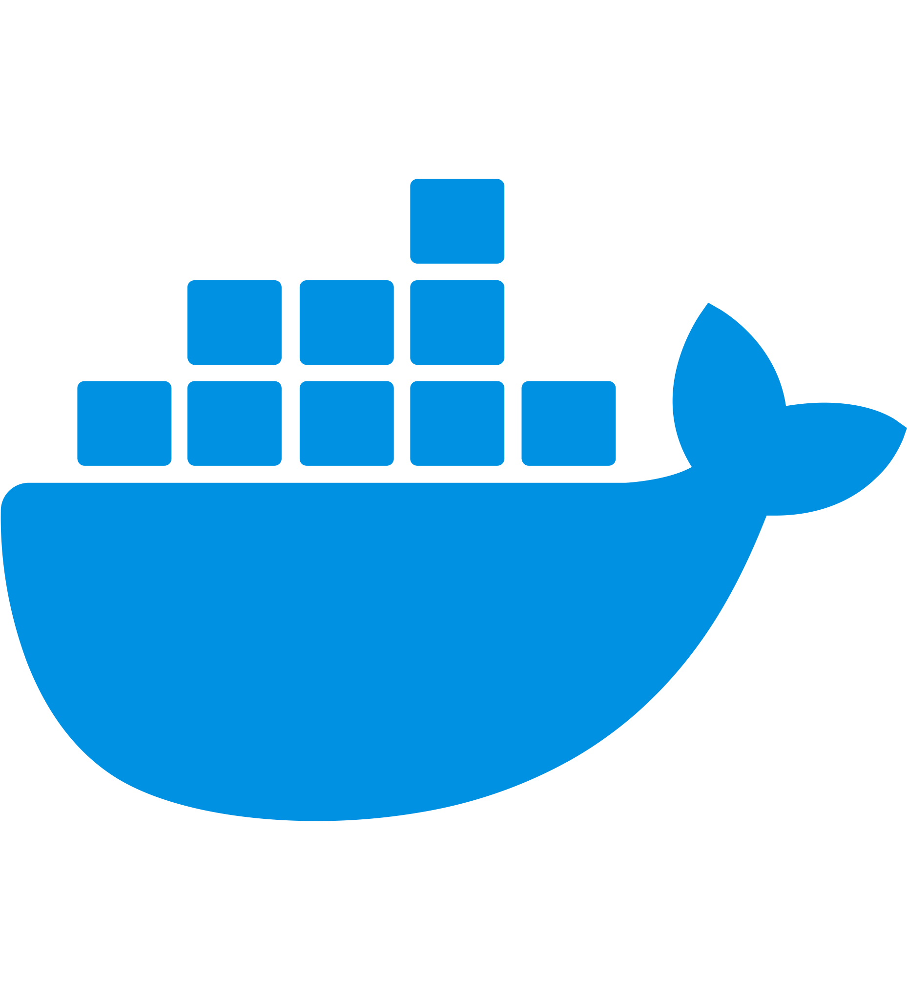

<!--  -->

<h1 align="center">Hi there I'm Pranav Masekar</h1>
<h3 align="center">I'm a Flutter Developer and DevOps enthusiast from India</h3>

<h1 align ="center">

 
 
</h1>

## 🙋‍♂️ About Me:

- 👨‍💻  **Open Source Contributor.**

- 🌱 **Learning DevOps.**

- 👨‍💻 Here are my blog's **[My Blog's](https://sungod.hashnode.dev/).**

- 📫 How to reach me **pranavmasekar4@gmail.com**.

## Latest Blog Posts 👇
<!-- HASHNODE_BLOG:START -->

<a href="https://sungod.hashnode.dev//flutter-gen" title="Elevating Flutter Development: The Magic of Code Generation"><strong>Elevating Flutter Development: The Magic of Code Generation</strong></a>
  Introduction :
Welcome back to my blog! In today's post, I want to share an exciting new tool that has elevated my Flutter development workflow - flutter_gen. As a Flutter developer, I'm always looking for ways to enhance code quality, accelerate dev... 
    

<a href="https://sungod.hashnode.dev//beyond-widgets" title="Beyond Widgets: Navigating the Realm of Render Objects in Flutter"><strong>Beyond Widgets: Navigating the Realm of Render Objects in Flutter</strong></a>
  Introduction :
Welcome to a fascinating journey into the heart of Flutter's UI magic! In this blog, we are going to the world beyond widgets. This other world is the world of Render Objects.
As Flutter developers, we know how important widgets are fo... 
    

<a href="https://sungod.hashnode.dev//sentry" title="Sentry - The Secret Weapon for Flutter Error Tracking"><strong>Sentry - The Secret Weapon for Flutter Error Tracking</strong></a>
  Introduction :
No one wants their flawless app to crash when it hits the hands of users. But the reality is that even the most robust Flutter apps can fail in production due to unanticipated errors and bugs. Without a proper error monitoring system, ... 
    
<!-- HASHNODE_BLOG:END -->

## 🚀 Languages and Tools:

 
    
     
     
    </a>  
     
     
      
    <a href="https://go.dev/" target="_blank"> 
     
    <a href="https://hub.docker.com/u/pranav18vk" target="_blank"> 
     
    <a href="https://kubernetes.io/" target="_blank"> 
     
    <a href="https://argo-cd.readthedocs.io/en/stable/" target="_blank"> 
     
    <a href="https://prometheus.io/" target="_blank"> 
     
    <a href="https://grafana.com/" target="_blank"> 
     
    <a href="https://www.jenkins.io/" target="_blank"> 
     
    <a href="https://circleci.com/" target="_blank"> 
     
    <a href="https://docs.github.com/en/actions/learn-github-actions/understanding-github-actions" target="_blank"> 
     
    <a href="https://www.terraform.io/" target="_blank"> 
     
    
     

 

## Connect with me:

 

 

 

